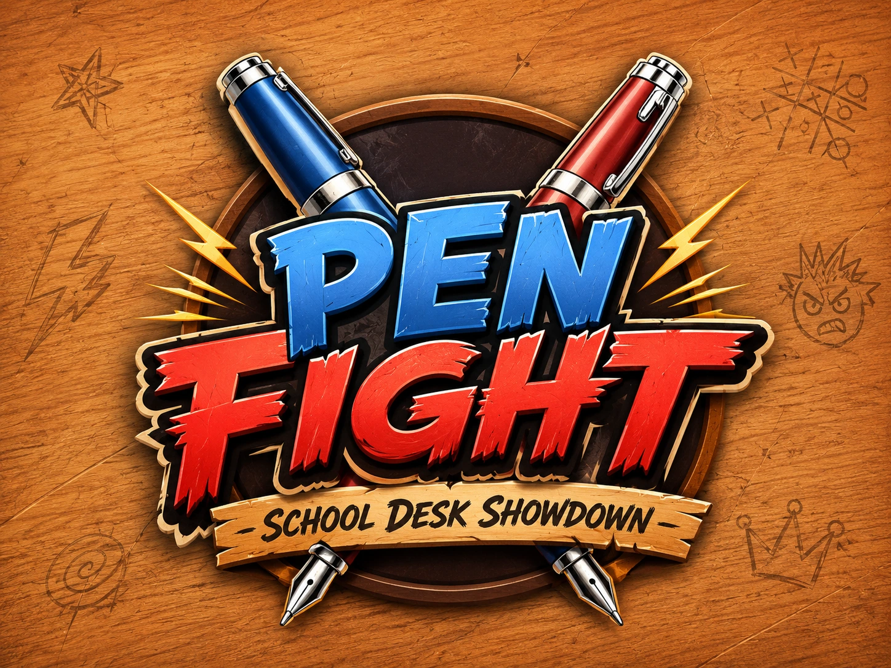
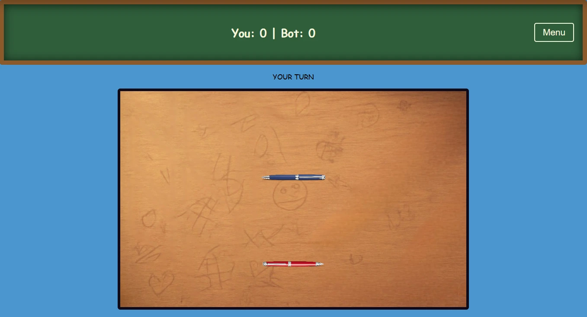
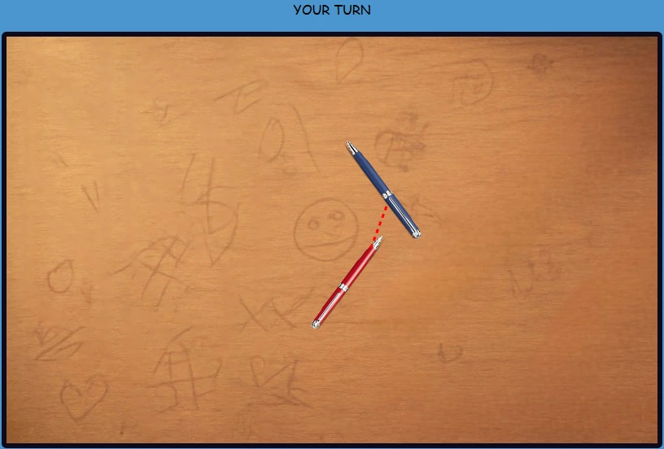
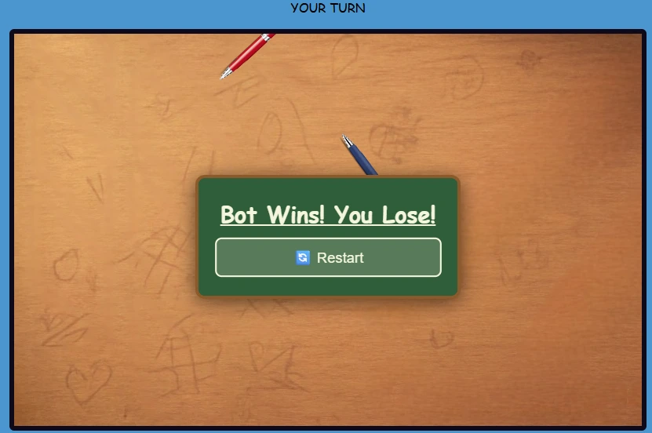

# Pen Fight

[](https://penfight.org/)
[](https://nextjs.org/)
[](https://pages.cloudflare.com/)



Pen Fight 是一个面向桌面浏览器的免费小游戏网站。玩家拖动红色笔蓄力，鼠标移动的反方向就是笔弹出的方向；松开鼠标后，目标是把蓝色对手撞出桌面，同时避免自己的红色笔掉出边界。

在线地址：[https://penfight.org/](https://penfight.org/)

> 本站是社区游戏的非官方浏览器入口。游戏、美术素材及相关权利归原作者所有。

## 游戏玩法



1. 按住红色笔并拖动鼠标，观察瞄准线和力度。
2. 笔会朝拖动方向的反方向弹出，拖得越远，通常冲量越大。
3. 松开鼠标完成一次攻击，利用碰撞和桌面边缘把蓝色笔推出场外。
4. 蓝色对手行动后继续下一回合；蓝色笔先出界即获胜，红色笔先出界则失败。

## 操作原理与实战攻略



- **反向蓄力：** 把拖动动作理解成拉弹弓。想向右上方出击，就向左下方拖动。
- **先控角度，再加力度：** 直线猛撞容易让双方一起接近边缘。优先寻找能把对手推向最近桌边的斜角。
- **利用笔身碰撞：** 笔是细长物体，撞击笔尖、笔尾与中部会产生不同的旋转。侧向擦碰通常比正面碰撞更适合改变对手方向。
- **保留安全距离：** 自己靠近桌边时先回到中心区域，不要为了高伤害把红色笔一同送出界。
- **观察对手下一回合：** 蓝色笔会反击。一次攻击后若停在对手的直线路径上，很容易被立即推出边界。



## 网站内容

- 内嵌自托管游戏，无需安装或下载。
- 完整的玩法说明、技巧攻略和常见问题。
- 本地成绩登记、排名与分数区间占比；成绩保存在当前浏览器中。
- 四段 YouTube 实战视频，便于快速理解操作节奏。
- 响应式导航、紧凑的 Play More 游戏卡片及移动端布局。
- 独立的 About Us、Privacy Policy、Contact、Terms of Service 页面。
- 静态导出、Sitemap、Canonical URL、Open Graph metadata 和隐私友好的站点统计说明。

## Plausible 统计

主站在根布局中通过 `next/script` 加载一次 Plausible 兼容统计脚本：

```text
Script: https://data.1back.link/js/app.js
API: https://data.1back.link/api/send
Domain: penfight.org
```

除聚合页面访问外，站点还记录导航点击、游戏启动与全屏、成绩登记、FAQ 展开、滚动深度和停留时间等有限事件。滚动深度与定时停留使用 `interactive: false`，不会改变跳出判定；游戏启动、成绩登记等真实操作仍作为互动事件。成绩事件仅使用分数区间，不发送玩家姓名、战术备注内容、精确分数或本地排行榜。详细说明见网站的 Privacy Policy。

## 技术栈

- Next.js 16（App Router）
- React 19
- TypeScript
- Tailwind CSS 4
- 静态导出至 `out/`
- GitHub 仓库存放编译产物，Cloudflare Pages 托管

## 本地开发

需要 Node.js 20 或更新版本。所有命令都应在项目根目录执行：

```powershell
cd D:\03_website\18-pen-fight
npm install
npm run dev
```

浏览器访问 `http://localhost:3000/`。如果出现“`next` 不是内部或外部命令”，说明依赖尚未安装，请先执行 `npm install`。

常用检查命令：

```powershell
npm run lint
npm run build
```

## 构建并保留 out/.git

部署仓库位于 `out/`，与项目源码仓库相互独立。请使用专用命令：

```powershell
cd D:\03_website\18-pen-fight
npm run build-preserve-git
```

该命令会自动：

1. 临时保存 `out/.git` 和 `out/README.md`。
2. 在 `.codex-static-build/` 中执行一次干净的 Next.js 静态导出。
3. 替换旧的静态网站文件，但不删除部署仓库的 Git 历史。
4. 恢复 `out/.git` 和 `out/README.md`。
5. 首次运行时初始化 `out/.git`、切换到 `main` 分支，并设置：

```text
origin = https://github.com/mooyu-king/pen-fight.git
```

因此，运行过 `npm run build-preserve-git` 后，不需要再次执行 `git init` 或 `git remote add origin`。

## 首次提交编译产物

完成构建后，进入 `out` 仓库提交：

```powershell
cd D:\03_website\18-pen-fight\out
git status
git add -A
git commit -m "first commit"
git push -u origin main
```

后续更新网站时：

```powershell
cd D:\03_website\18-pen-fight
npm run build-preserve-git
cd out
git add -A
git commit -m "Update Pen Fight site"
git push
```

> 提交前建议先执行 `git status`，确认变更只包含准备部署的静态文件。构建脚本只负责构建、保留仓库和配置远程地址，不会自动提交或推送。

## Cloudflare Pages 配置

GitHub 仓库本身已经是编译完成的静态网站，因此 Cloudflare Pages 连接 `mooyu-king/pen-fight` 后可按纯静态站点设置：

- Production branch：`main`
- Framework preset：`None`
- Build command：留空
- Build output directory：`.`
- 自定义域名：`penfight.org`

部署后请检查首页、`/about/`、`/privacy/`、`/contact/`、`/terms/`、游戏 iframe、图片、视频和移动端导航是否可正常访问。

## 目录说明

```text
18-pen-fight/
├─ public/                 图片、Logo 与自托管游戏文件
│  └─ game/                iframe 加载的游戏静态资源
├─ scripts/
│  └─ build-preserve-git.mjs
├─ src/app/                首页、信任页面与站点组件
├─ out/                    编译后的独立部署仓库
│  ├─ .git/                必须保留的 Git 历史和远程配置
│  └─ README.md            GitHub 仓库说明
└─ README.md               源码项目说明
```

## 图片与数据说明

网站 Logo 同时用于顶部导航和浏览器 favicon。页面中的多张 `pen-fight-*.webp` 图片分布在玩法、攻略、游戏推荐等内容区域。互动区的成绩与昵称只保存在用户当前浏览器的 `localStorage` 中，清除浏览器数据后记录会消失。

## 维护提醒

- 每次发布都使用 `npm run build-preserve-git`，不要直接删除整个 `out/`。
- 不要在项目根目录执行部署仓库的 `git add` 和 `git push`；部署命令必须在 `out/` 中执行。
- 更换 Logo 或游戏截图后重新构建，静态文件会自动同步到 `out/`。
- 若 GitHub 远程仓库地址发生变化，请同步修改 `scripts/build-preserve-git.mjs` 中的 `deployRemote`。
